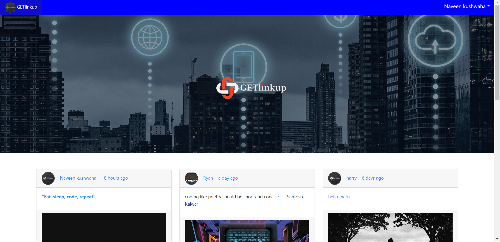
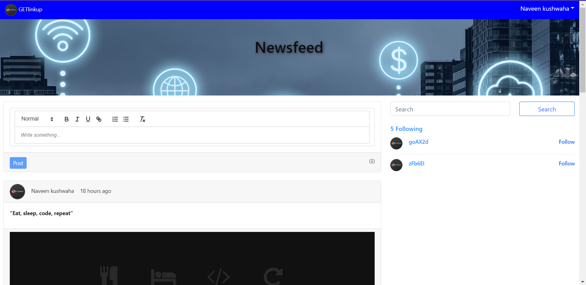
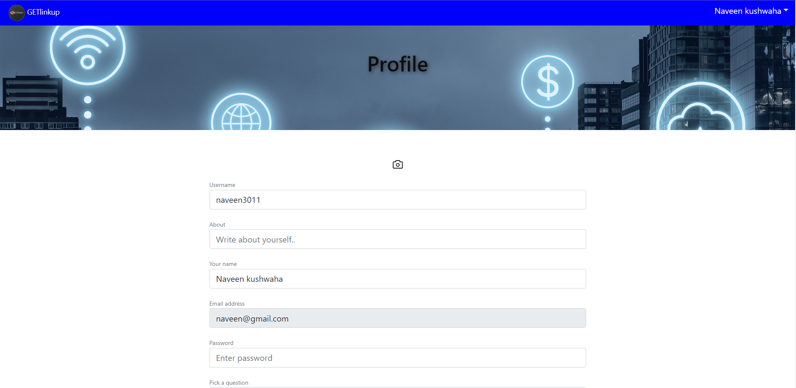

# GETlinkup-social-media [Link](https://getlinkup.onrender.com/)

This is my social media application, a platform built with Next.js, React.js, Node.js, Express, and MongoDB. It utilizes server-side rendering (SEO) to provide improved performance and search engine optimization.

## Features

### Authentication and User Management

- Implemented authentication using JSON Web Tokens (JWT) for secure user login and registration.
- Integrated social login functionality to allow users to sign in using their existing social media accounts.
- Added password forgot/reset functionality to enable users to recover their accounts.

### Admin Dashboard

- Designed an intuitive admin dashboard with role-based authorization and permissions.
- Administrators can manage user-post relationships, such as approving or deleting user-generated content.
- Provided functionality to upload and manage user profile images.

### User Interactions

- Developed user follow/unfollow functionality to facilitate social connections and interactions.
- Implemented post like/unlike feature to allow users to engage with and express appreciation for posts.
- Enabled commenting capabilities, fostering discussions and engagement within the community.

### Real-time Updates

- Integrated Socket.io to enable real-time updates on the home page when new posts are added.
- Users can receive instant notifications about new content, enhancing the overall user experience.

## Getting Started

To run the social media application locally, follow these steps:

1. Clone the repository.
2. Install the required dependencies using `npm install`.
3. Set up the MongoDB database and configure the connection details.
4. Run the development server using `npm run dev`.
5. Access the application at `http://localhost:3000`.

Feel free to explore the code and make any necessary modifications to suit your specific requirements.

## Screenshots

### Homepage

### News Feed

### User Profile

## Contribution

Contributions are welcome! If you find any issues or have suggestions for improvements, please open an issue or submit a pull request.

## License

This project is licensed under the [MIT License](LICENSE), which means you are free to use, modify, and distribute the code as you see fit.

---
